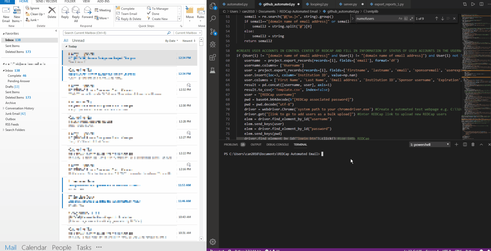
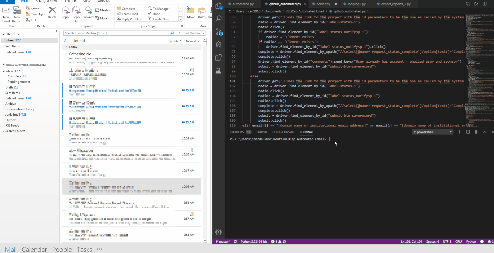
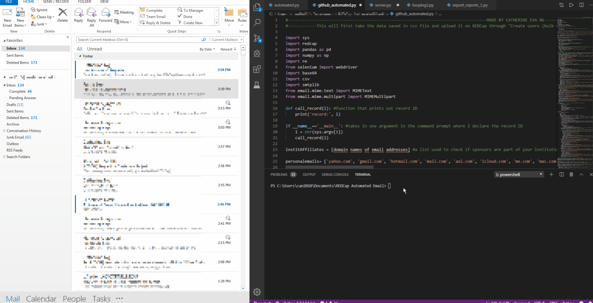
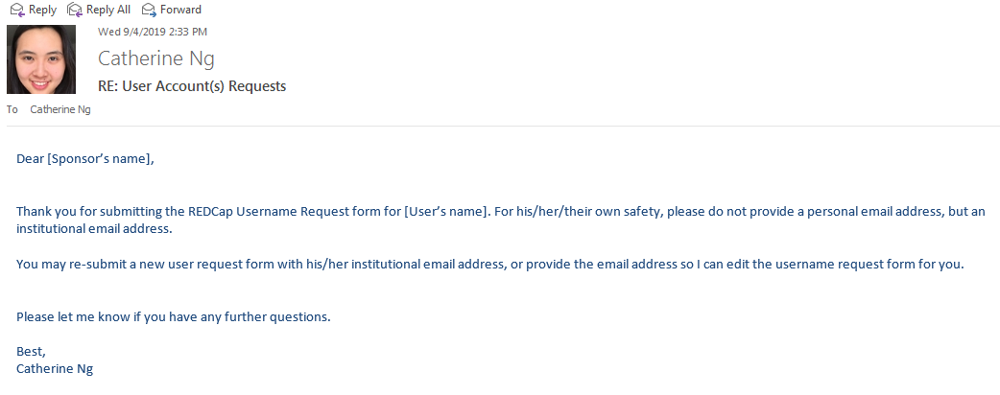
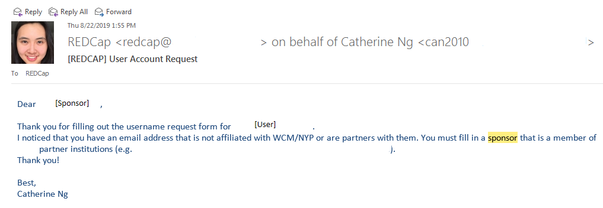

# REDCap User Accounts Creation
This project was created with the intention that others can use it to create a user account, assuming there is an existng REDCap project with a survey that allows users to sign up for a user account. The survey contains the user's first name, last name, institutional email address, and the sponsor that is responsible for the account (suspended, expired, etc.) One can then go to the Control Center to add the User Accounts, and use 'Bulk Upload' to upload a csv file of all the user's names, email address, and sponsor. I use [Selenium](https://selenium-python.readthedocs.io/) to automate the process of clicking through webpages to create the User Accounts.I also use MIMEText to send emails to the users once the accounts have been created.</p> 


```diff
+ this text is highlighted in green
- this text is highlighted in red
```

```html
<font color = 'red'> The font color is red </font>
```

1) When the REDCap user account creation is successful:


2) When the REDCap user account was already created:



3)Other issues:
<ul>
  <li>When the user is part of the main institution (have their own username and associated password and can automatically log into REDCap)</li>
  
  <li> When the user provides a personal email </li>
  
  <li> When the sponsor is not from the main institution or affiliated institutions </li>
  
```python 
    name = user[0]['firstname'] + ' ' + user[0]['lastname'] #get the users' first and last name
    subject = "User Account(s) Requests"
    recipient = "can2010@med.cornell.edu"
    sender = "can2010@med.cornell.edu"
    cc = "cathygreat828@gmail.com"
    password = base64.b64decode(b'UG9vcHNAIzQ=')
    password = password.decode("utf-8")

    message = MIMEMultipart("alternative")
    message["From"] = sender 
    message["To"] = recipient
    message["Subject"] = subject
    message["Cc"] = cc
    html = """\
    <html>
        <body>
            <p style= "color:#1E497D; font-family: Calibri, sans-serif;">Dear {sponsorname}, <br>
                <br>Thank you for filling out the username request form for {name} and others.</br>
                I noticed that you have an email address that is not affiliated with WCM/NYP or are partners with them.
                You must fill in a sponsor that is a member of WCM CTSC partner institutions (e.g. WCM/NYP, Cornell, MSKCC, HSS, Hunter College, AMC, Burke, etc). 
                <br>Thank you! </br>
                <br>Best,</br>
                Catherine Ng </br>
            </p>
        </body>
    </html>""".format(**locals())
    part2 = MIMEText(html,"html")
    message.attach(part2)
    text = message.as_string()

    s = smtplib.SMTP("smtp.office365.com", 587)
    s.ehlo()
    s.starttls()
    s.login(sender, password)
    s.sendmail(sender, recipient, text)
    print('done!')
    s.quit() 
```    
